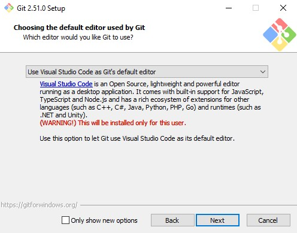

# Руководство пользователя: работа с Git и GitHub

Цель данного документа: предоставить четкую, пошаговую инструкцию для выполнения базовых операций системы контроля версий **Git** через интерфейс командной строки **Git Bash** с последующей публикацией кода на хостинге **GitHub** для пользователей операционной системы Windows.

## Оглавление

- [Оглавление](#оглавление)
- [Введение](#введение)
- [Установка Git и Git Bash для Windows](#установка-git-и-git-bash-для-windows)
  - [Инструкция по установке](#инструкция-по-установке)

## Введение

Это руководство подойдёт:

* *Начинающим разработчикам*
* *Техническим писателям*
* *Специалистам смежных IT-профессий*

**Git** - это специальная программа, которая позволяет отслеживать любые изменения в файлах, хранить их версии и оперативно возвращаться в любое сохранённое состояние.

**Git Bash** - это эмулятор командной строки, который предоставляет пользователям Windows доступ к среде выполнения команд Git  с интерфейсом в стиле Unix.

**GitHub** - это крупнейший веб-сервис для хостинга IT-проектов и их совместной разработки. Веб-сервис основан на системе контроля версий Git.

## Установка Git и Git Bash для Windows

Перед началом работы необходимо установить **Git**, который включает в себя **Git Bash** - эмулятор командной строки для работы с **Git**.

### Инструкция по установке

1. **Скачайте установочный файл с официального сайта** 
   
    Перейдите на [официальный сайт Git](https://git-scm.com/). Нажмите на кнопку **Download for Windows**. Будет скачан установочный файл.

2. **Запустите установочный файл** 
   
   Дважды щелкните по скачанному файлу. Появится окно контроля учетных записей. Нажмите «Да», чтобы разрешить приложению вносить изменения.

3. **Настройте параметры установки**

    Следуйте шагам мастера установки. Рекомендуется оставить настройки по умолчанию, но на некоторых шагах стоит заострить внимание:
    * **Select Components** : Оставьте все галочки по умолчанию. Убедитесь, что `Git Bush` и `Git GUI` выбраны.
     
     
    

    * **Choosing the default editor** : Если вы планируете писать код в VSCode, выберите Visual Studio Code из выпадающего списка. Если вы не уверены, оставьте Vim.
     
      
    

  

   